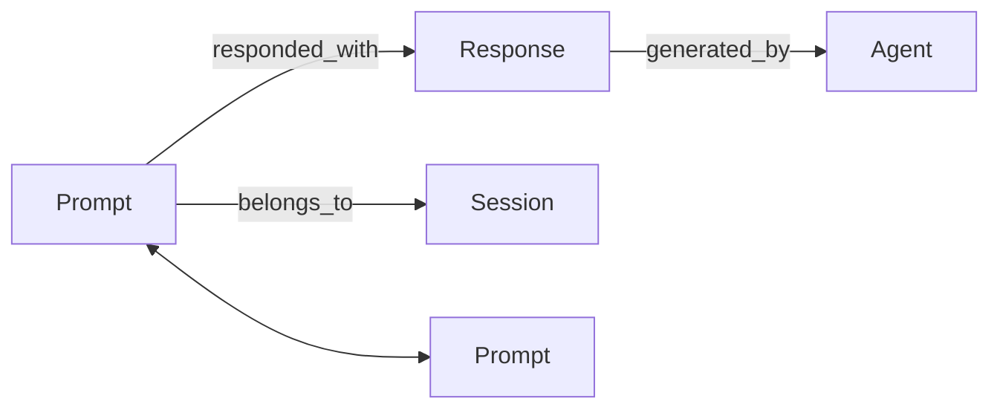

# RaeburnMemory

This repository implements a simple persistent memory graph for storing LLM interactions.
It provides a `MemoryGraph` class that records prompts, responses, agents and sessions
in a directed graph using `networkx`. Embeddings are stored in a FAISS index that is
persisted alongside the graph so vectors survive between runs.

Key features:
- Add interactions and link prompts to responses and agents.
- Store prompt embeddings with a FAISS vector index.
- Persist the index to disk with `faiss.write_index` when available.
- Retrieve semantically similar prompts.
- File locking prevents corruption when multiple processes access the graph.
- Works without optional libraries thanks to lightweight fallbacks for
  `networkx`, `faiss` and the embedding model.



## Usage
The graph persists to disk so it can be rebuilt on the next run. When no
embedding model is available the class falls back to a dummy encoder so
tests and examples work offline. If `networkx` or `faiss` are missing,
pure-Python replacements are used automatically.

```python
from raeburnmemory.memory_graph import MemoryGraph

mg = MemoryGraph(db_path="graph.json", embedding_model=None)
mg.add_interaction(
    prompt={"id": "p1", "text": "Hello?"},
    response={"id": "r1", "text": "Hi!"},
    agent={"id": "a1", "name": "Greeter"},
    session_id="s1",
)
mg.export()

mg2 = MemoryGraph(db_path="graph.json", embedding_model=None)
print(mg2.get_similar_prompts("Hello"))
```

The class also exposes async helpers like `add_interaction_async` and
`batch_add` so interactions can be persisted concurrently.

### Embedding model configuration
By default `MemoryGraph()` loads the `all-MiniLM-L6-v2` SentenceTransformer
which will download the weights the first time it is used. Pass a different
model name to use another encoder or `None` to disable embeddings entirely:

```python
from raeburnmemory.memory_graph import MemoryGraph

# load the default model
mg = MemoryGraph()

# or specify an alternative model
mg = MemoryGraph(embedding_model="all-mpnet-base-v2")
```

You can also configure the model via the `RAEBURN_EMBED_MODEL` environment
variable. Set it to a model name or to `none` to disable embeddings.

The graph is stored in `~/.raeburnbrain/graph.json` by default. A FAISS index is
persisted next to it in `graph.json.faiss` when FAISS supports index
serialization. Older versions fall back to `graph.json.vectors.npy` for the raw
vectors along with `graph.json.map.json` mapping prompt IDs to rows. Setting
`db_path` changes the location of these files.

### Storage backend
Pass `storage_backend="sqlite"` to persist the graph in a SQLite database
instead of JSON files. The database file defaults to
`~/.raeburnbrain/graph.db` (or uses the provided `db_path` with a `.db`
extension). Any existing JSON files are migrated on first use. When the
optional `pgvector` module is installed vectors are stored using that type,
otherwise they fall back to BLOB columns.
With pgvector installed, SQLite can perform efficient similarity search using
its `vector` functions.

```python
from raeburnmemory.memory_graph import MemoryGraph

mg = MemoryGraph(storage_backend="sqlite", db_path="mem.db")
```
SQLite connections use WAL mode and are closed automatically when the
`MemoryGraph` instance is deleted or when used as a context manager:

```python
with MemoryGraph(storage_backend="sqlite") as mg:
    mg.add_interaction(...)
```

### Vector backends
FAISS is used by default to store embeddings in-memory. Alternatively set
`vector_backend="qdrant"` to persist vectors in a Qdrant collection. The
Qdrant client connection is pooled per URL for efficiency.

### Optional dependencies and fallbacks
`raeburnmemory` runs even when `networkx`, `faiss` or
`sentence-transformers` are not installed. Lightweight pure-Python
implementations provide basic graph and vector functionality and a dummy
embedding model returns zero vectors. This allows the tests and CLI to
function offline or in minimal environments, albeit with reduced
performance and no real semantic similarity.

## Requirements
- Python 3.10+
- `networkx==3.5`
- `faiss-cpu==1.11.0.post1`
- `filelock==3.13.1` *(for safe concurrent file access)*
- `typer==0.16.0`
- `sentence-transformers==5.0.0` *(optional – only needed when using real embeddings)*
- `fastapi==0.111.0`, `starlette==0.37.2`, `uvicorn==0.35.0`, `httpx==0.28.1` *(optional – API support)*
- `pgvector==0.2.3` *(optional – used with the SQLite backend)*
- `qdrant-client==1.15.0` *(optional – enables the Qdrant vector backend)*

Install dependencies with pinned versions:
```bash
pip install -r requirements.txt
```

You can also install the package directly from this repository:
```bash
pip install git+https://github.com/<your-username>/RaeburnMemory.git
```

Install optional features with extras, for example including the FastAPI API:
```bash
pip install raeburnmemory[fastapi]
```
Multiple extras can be combined, e.g. `pip install raeburnmemory[fastapi,pgvector,qdrant]`.

## Running Tests
Install the dependencies listed in `requirements.txt` and run the tests:
```bash
pip install -r requirements.txt
pytest -q
```
The tests use a dummy embedding model so they run offline without downloading weights.

## API
A small FastAPI application is provided in `raeburnmemory.api`.
For local testing run `uvicorn raeburnmemory.api:app --reload`. In
production you would typically launch it with multiple workers:

```bash
uvicorn raeburnmemory.api:app --host 0.0.0.0 --port 8000 --workers 4
```

Once running you can access:

- `GET /memory/graph` – returns the current graph JSON
- `POST /memory/similar` – supply `{"text": "..."}` to retrieve similar prompt IDs
  (returns an error if no embeddings are stored)

Set `RAEBURN_API_KEY` to require a `Bearer` token for all API requests and
`RAEBURN_RATE_LIMIT` to limit the number of requests per minute. For example
`RAEBURN_RATE_LIMIT=60` allows 60 requests per client IP.

## Command Line Interface

The package provides a small CLI built with [Typer](https://typer.tiangolo.com)
for managing the graph. After installing you can use the `raeburnmemory`
command or run the module directly.

Add an interaction:

```bash
raeburnmemory --db graph.json add \
  --prompt-id p1 --prompt-text "Hello" \
  --response-id r1 --response-text "Hi" \
  --agent-id a1 --agent-name "Greeter" \
  --session-id s1
```

Export the graph to a file:

```bash
raeburnmemory --db graph.json export --output export.json
```

Query similar prompts:

```bash
raeburnmemory --db graph.json similar --text "Hello"
```

The CLI validates the database path and will exit with an error message if the
graph or its embeddings are missing.

## Documentation
Documentation is built with [MkDocs](https://www.mkdocs.org). The site is automatically deployed from the `main` branch using GitHub Pages. After installing the `docs` extra you can run `mkdocs serve` to preview locally.

## Publishing to PyPI

1. Update `CHANGELOG.md` with a new section for the release.
2. Bump the version in `pyproject.toml` and commit the change.
3. Tag the commit: `git tag -a vX.Y.Z -m "Release vX.Y.Z" && git push --tags`.
4. Build the distribution:
   ```bash
   python -m build
   ```
5. Upload to PyPI using `twine`:
   ```bash
   twine upload dist/*
   ```

Ensure the changelog documents notable changes for each version following the
[Keep a Changelog](https://keepachangelog.com) format.

## License

This project is released under the [MIT License](LICENSE).
