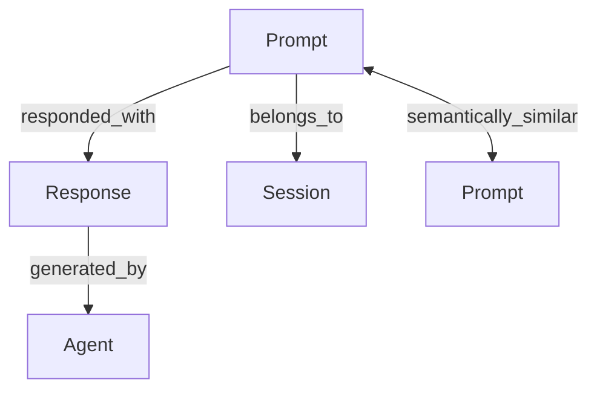

# RaeburnMemory Documentation

This site hosts the full documentation for the RaeburnMemory package.

```mermaid
flowchart TD
    Prompt -->|responded_with| Response
    Response -->|generated_by| Agent
    Prompt -->|belongs_to| Session
    Prompt <-->|semantically_similar| Prompt2[Prompt]
```

See the [API reference](api.md) for details.
